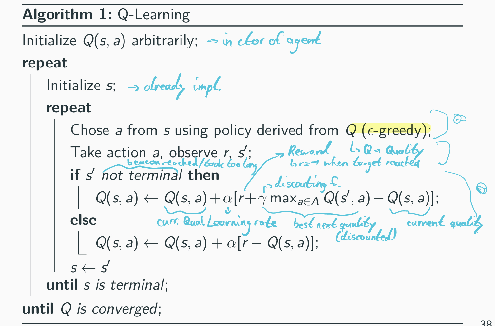
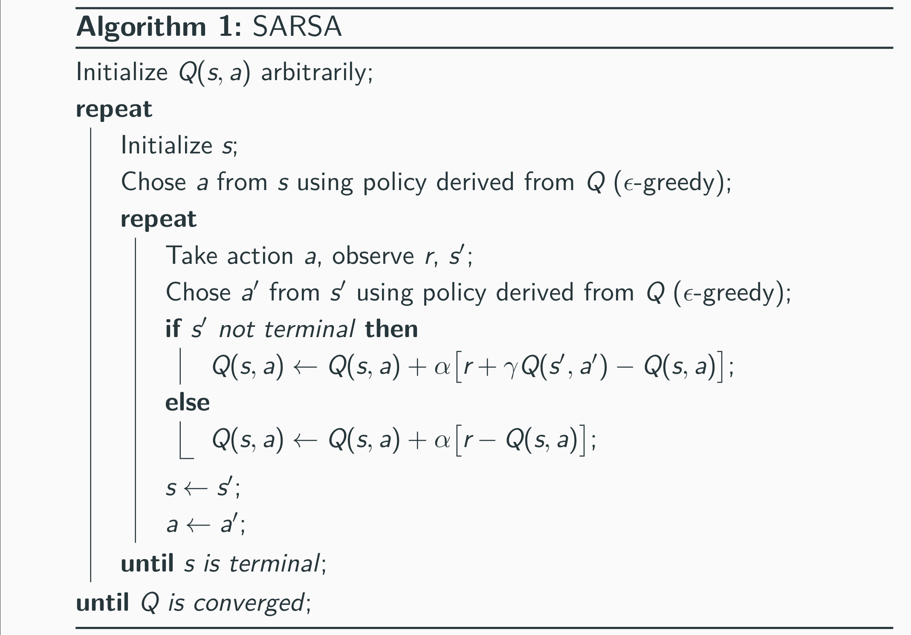
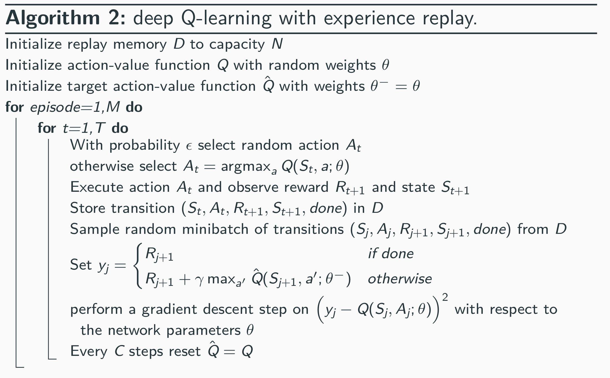
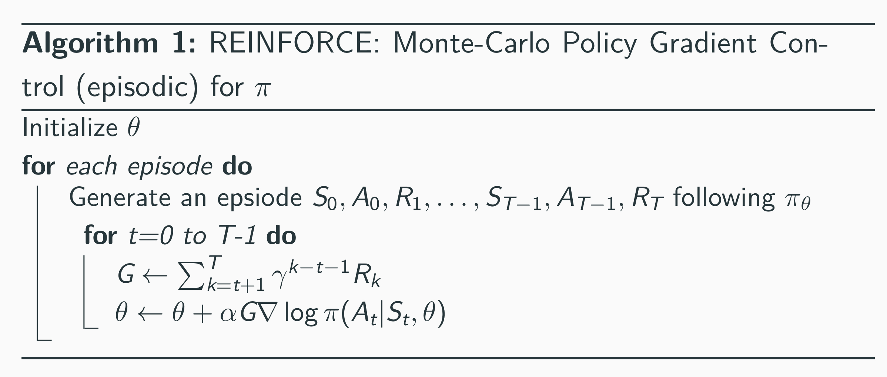

# Agents
## BasicAgent
This agent moves directly to the beacon and therefore returns the best result. Other agents can be compared with
this agent to assess their performance.

## RandomAgent
This agent moves randomly. Other agents can be compared with this agent to assess their performance. Agents
shouldn't be worse than the RandomAgent, otherwise they don't work correctly.

## QLearningAgent (QLAgent)
Q-learning is a model-free reinforcement learning algorithm for finding an
optimal action-selection policy. It works by learning a Q-value function that
describes the value of taking a given action in a given state. The Q-value is
updated iteratively based on the action taken in the previous time step and the
resulting reward. The goal of Q-learning is to find the optimal Q-value function,
which will yield the optimal action-selection policy. This is typically done
through a process of trial and error, where the algorithm explores different
actions and updates the Q-values based on the rewards it receives. Over time,
the Q-values converge to the optimal values, and the algorithm is able to select
the optimal actions in any given state.

This agent uses a Q-table containing an estimation of the value of the possible
actions for all states. So the Q-table has the dimensions nb_states x nb_actions.

Because the estimation of values is only an estimation and has an error
\- especially in the beginning of the learning process - the algorithm uses an
exploration strategy to balance the needs for exploration and exploitation.
The executed action is selected according to the exploration strategy.

In the beginning the values are initialized randomly.

After an action was executed, the reward and resulting state is observed.
The Q-values of the previous state are updated according to the following rule:

If the current state is terminal (either the beacon was reached or the episode
reached the max. number of simulation steps), the Q value of the previous state
updated like this:

Q(s,a) = Q(s,a) + alpha * ( r + gamma * max_action( Q(s',a) ) - Q(s,a) )
* Q(s,a) = q-value of the previous state
* alpha = learning rate
* r = reward of the current state
* gamma = discounting factor (how much a terminal state (beacon reached) should propagate to the previous state)
 
Otherwise: Q(s,a) = Q(s,a) + alpha * ( r - Q(s,a) )

## SARSAAgent
The SARSAAgent works the same as the QLearningAgent, but uses a more 
"conservative" SARSA learning component. The name *SARSA* is short for 
State-Action-Reward-State-Action (S_t, A_t, R_t+1, S_t+1, A_t+1).

In contrast to QLearning in SARSA learning the qvalue of the following state is taken for the action *that was actually executed by the agent* instead of 
the action that was proposed. This makes SARSA more conservative, because a 
bad random action during an exploration step will propagate the bad reward to 
the previous state, even if this state has proposed another action than the 
one executed.

As an example, in a 2D environment with an edge that the agent can fall off and 
get punished for, the SARSAAgent will walk further away from the edge. If the 
best strategy had been to walk along the edge, in contrast to the QLearningAgent,
the SARSA will probably not find the optimal solution, but also will fall down 
the edge far less often.

## DeepQLearningAgent (DQNAgent)
Standard *Qlearning* with a Qtable has limit when then state space and/or action space increase in size, because the Qtable gets very big and takes a lot of time to learn.

The solution for this is a DeepQLearningAgent, which **approximates the QTable with a Neural Network**. The Neural Network can then **generalize its knowledge of visited states to not-visited states**. It abstracts patterns and understands actions based on existing patterns.

NOTE: A smaller state space might not automatically speed up the training process, if it makes it harder for the Neural Network to generalize.

### Hyperparameters of the network
#### Network
Hyperparameters at initialization:
* learning_rate

#### Exploration strategy
Hyperparameters at initialization:
* exploration rate *epsilon*
* params for change of epsilon (epsilon_start, epsilon_end, ...)

#### 

### Improvements
#### Experience Replay
**Experience Replay** remembers the last N transitions (S_t, A_t, R_t+1, S_t+1, done). Instead of learning only from the last transition, the algorithm samples a random minibatch (e.g. 32 transitions) from the experience replay and executes the qvalue updates on these values (FIFO).
This functionality removes correlation between the single observations and makes the changes in the data distribution smoother. Also, transitions are used multiple times for training, which makes this more data efficient.

The *Experience Replay* gets implemented by using not one, but **two Neural Networks** - the **Q Network**, which gets updated every step and now additionally the **Target Network**, which is used during the training for calculating the target qvalue for the loss function and only gets updated slowly and periodically (e.g. every n steps).

#### Error Clipping
In **Error Clipping** upper and lower bounds are defined for the errors (e.g. the range [-1,1]). This leads to a more stable learning behaviour.

## DoubleDQNAgent (DDQNAgent)
TODO

## DuelingDQNAgent (DuelDQNAgent)
TODO

## Dueling DDQN with Prioritized experience replay (CNN)
TODO

## Monte Carlo Policy Gradient
TODO

