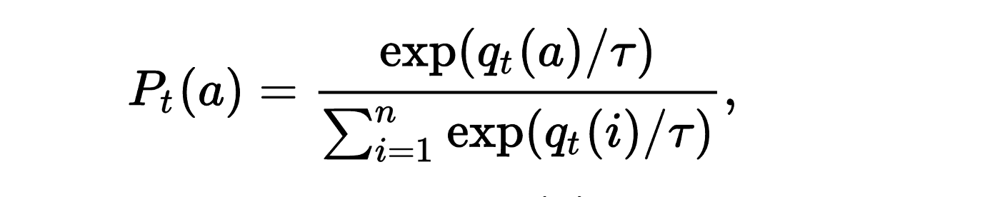

# Exploration Strategies
A reinforcement learning algorithm uses an exploration strategy to try out different actions and gather information about their consequences, in order to learn the best way to act in a given situation.

Some common exploration strategies include random exploration, where the algorithm tries out random actions to gather information.

## Epsilon Greedy Exploration
In *Epsilon Greedy Exploration* the algorithm balances exploration and exploitation by trying out new actions with a certain probability using a parameter called *epsilon*.

The algorithm will take the best action (the one that it expects will lead to the highest reward) with a probability of *1-epsilon*. This is known as **exploitation**, because the algorithm is exploiting its current knowledge about the environment to take the best action.

With a probability of *epsilon*, the algorithm will instead take a random action. This is known as **exploration**, because the algorithm is exploring the environment to gather new information and improve its understanding of the problem.

The **value of epsilon is typically set to a small number**, such as 0.1 or 0.01. This means that the algorithm will mostly take the best action, but will occasionally explore by taking random actions. This allows the algorithm to gather new information and improve its performance over time.

Usually, epsilon isn't a fixed value, but instead set to **decrease over time** (e.g. linearly), because in the beginning the qvalues are not very accurate and more exploration is necessary.

## Boltzmann Exploration
In the Boltzmann exploration strategy, the probability of taking a certain action is **determined by a Boltzmann distribution**. This distribution assigns **exponentially higher probabilities to exploratory actions** such as those that are not currently known to be the best option, and lower probabilities to exploitative actions such as those that are known to be the best option based on previous experience.

Contrary to the *Epsilon Greedy Exporation* the *Boltzmann Exploration* **considers the reward of all options in the equation** when deciding for an action while **in epsilon greedy it made no difference, if another action was second/third/... best - the random action was chosen from all actions uniformly**.

The **temperature parameter tau** in the Boltzmann distribution controls the amount of exploration vs exploitation. A high temperature will result in more exploration, while a low temperature will result in more exploitation. 

The temperature can either be set manually or **adjusted automatically over time**, depending on the needs of the learning system.

The following equation describes the bolzmann distribution:

More information can be found [here](https://medium.com/emergent-future/simple-reinforcement-learning-with-tensorflow-part-7-action-selection-strategies-for-exploration-d3a97b7cceaf).